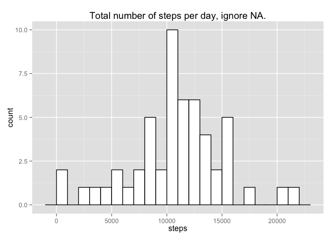
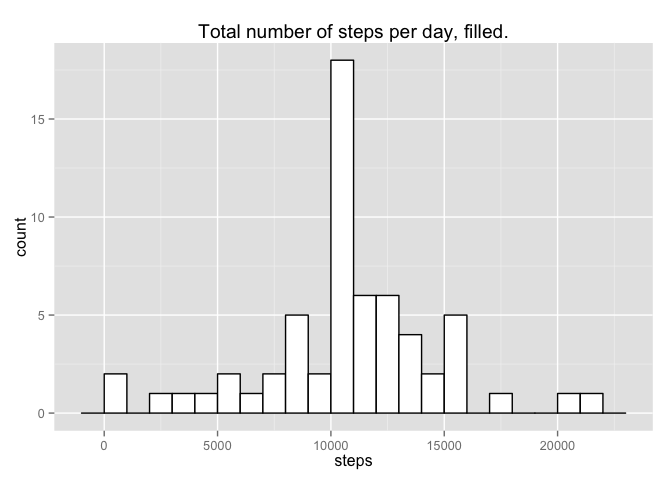
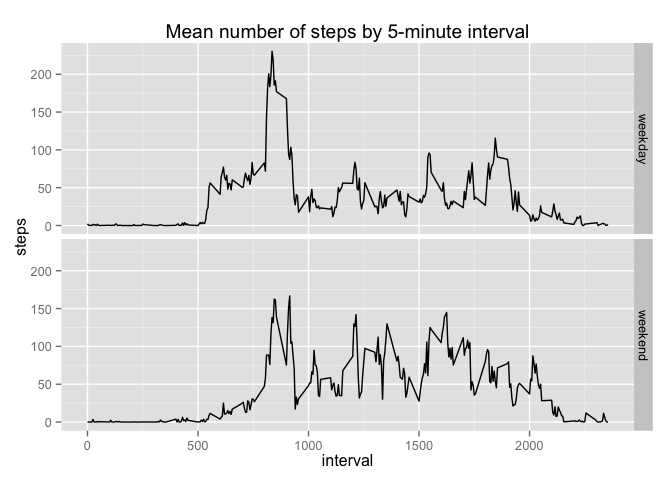

## Loading and preprocessing the data


```r
activity <- read.csv(unz("activity.zip","activity.csv"), header=T, colClasses=c("numeric","Date","numeric"))
```

## What is mean total number of steps taken per day?


```r
good <- activity[!is.na(activity[[1]]),]
total_steps <- sum(good$steps)
```
The total number of steps taken: 5.70608 &times; 10<sup>5</sup>


```r
#head(good)
sum_steps_per_day <- aggregate(steps ~ date, data = good, FUN = sum)
library(ggplot2)
ggplot(sum_steps_per_day, aes(x=steps)) +
  geom_histogram(binwidth=1000, colour="black", fill="white") +
  ggtitle("Total number of steps per day, ignore NA.")
```

 


```r
mean_steps <- mean(sum_steps_per_day$steps)
med_steps <- median(sum_steps_per_day$steps)
```
Mean number of steps per day: 1.0766189 &times; 10<sup>4</sup>
Median number of steps per day: 1.0765 &times; 10<sup>4</sup>

## What is the average daily activity pattern?


```r
mean_steps_per_interval <- aggregate(steps ~ interval, data = good, FUN = mean)
library(ggplot2)
ggplot(mean_steps_per_interval, aes(x=interval, y=steps)) + geom_line()
```

 


```r
max_id <- which.max(mean_steps_per_interval$steps)
max_steps_interval <- mean_steps_per_interval$interval[max_id]
```
835 interval, on average across all the days in the dataset, contains the maximum number of steps.


## Imputing missing values


```r
total_missing <- sum(is.na(activity[[1]]))
```
The total number of missing values in the dataset: 2304.


```r
fill_strategy <- function(chunk) {
  mean_steps <- mean(chunk$steps,na.rm = T);
  chunk[is.na(chunk$steps),]$steps <- mean_steps;
  chunk
}
```


```r
filled <- do.call(rbind, lapply(split(activity,activity$interval), function(chunk) fill_strategy(chunk)))
```


```r
sum_filled_steps_per_day <- aggregate(steps ~ date, data = filled, FUN = sum)
ggplot(sum_filled_steps_per_day, aes(x=steps)) +
  geom_histogram(binwidth=1000, colour="black", fill="white") +
  ggtitle("Total number of steps per day, filled.")
```

 

```r
mean_filled_steps <- mean(sum_filled_steps_per_day$steps)
med_filled_steps <- median(sum_filled_steps_per_day$steps)
```
The mean total number of steps taken per day: 1.0766189 &times; 10<sup>4</sup>.
The median total number of steps taken per day: 1.0766189 &times; 10<sup>4</sup>.

Mean estimate not  changed.
Median estimate  changed.

The impact of imputing missing data on the estimates of the total daily number of steps:  
- Difference in mean number of steps per day: 0.  
- Difference in median number of steps per day: 1.1886792.

## Are there differences in activity patterns between weekdays and weekends?


```r
weekend_bool <- weekdays(filled$date) %in% c('Saturday','Sunday')
weekend_factor <- factor(as.numeric(weekend_bool), labels=c("weekday", "weekend"))
wdata <- cbind(filled, data.frame(weekend = weekend_factor))
```


```r
library(ggplot2)

mean_wday_steps <- aggregate(steps ~ interval + weekend, data=wdata, FUN=mean)

p <- ggplot(mean_wday_steps, aes(x=interval, y=steps)) +
    geom_line() +
    ggtitle("Mean number of steps by 5-minute interval")

p + facet_grid(weekend ~ .)
```

 

